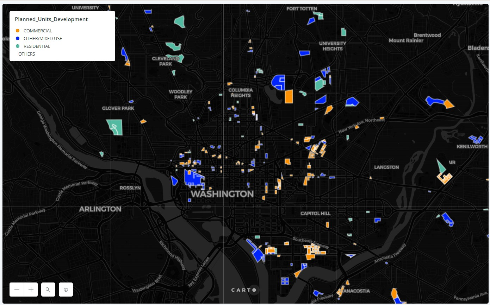

# Creating Zoning Maps using Python and Pandas

This assignment works on the data from Open Data DC covering their Planned Unit Developments and Affordable Housing page. United States is facing a housing crisis. The cost of housing has been increasing inevitably. In this assignment we are using Python to gather open data about zoning in D.C. and are creating a map of zoning exemptions using Carto. We start be translating maps to tables. Packages such as Pandas, shapely, rtree and spatialindex and geopandas library are used in the analysis. We start by working in Google collab to create a master GeoDataFrame which contains the information about zoning exemptions as well as affordable housing projects at the same geographic locations. We intialize the map making process in colab using the .plot() function. 

For our final map, we use Carto. where we have published our map. 

The map link can be found here: "https://arpitashalini.carto.com/builder/d29199de-1962-4497-8c35-3272c18e0738/embed?state=%7B%22map%22%3A%7B%22ne%22%3A%5B38.864439229583375%2C-77.06737518310548%5D%2C%22sw%22%3A%5B38.94966390388528%2C-76.98789596557619%5D%2C%22center%22%3A%5B38.9070643560226%2C-77.02763557434082%5D%2C%22zoom%22%3A13%7D%7D"
